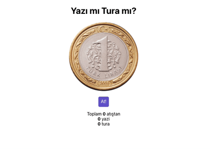

# kodluyoruzreactodev2
## Yazı Tura

Yalnızca bir madeni paraya ihtiyaç duyulan, oldukça kolay oynanabilecek ve dünyanın hemen her yerinde yaygın olan yazı tura oyununu React ile yapalım.

  

### Proje Nasıl Çalıştırılır

- Projeyi fork'ladıktan ya da indirdikten sonra projenin bulunduğu klasörde "npm install" komutu ile gerekli paketlerin yüklenmesi gerekiyor.
- Daha sonra "npm run start" komutu ile uygulama başlatılabilir.

